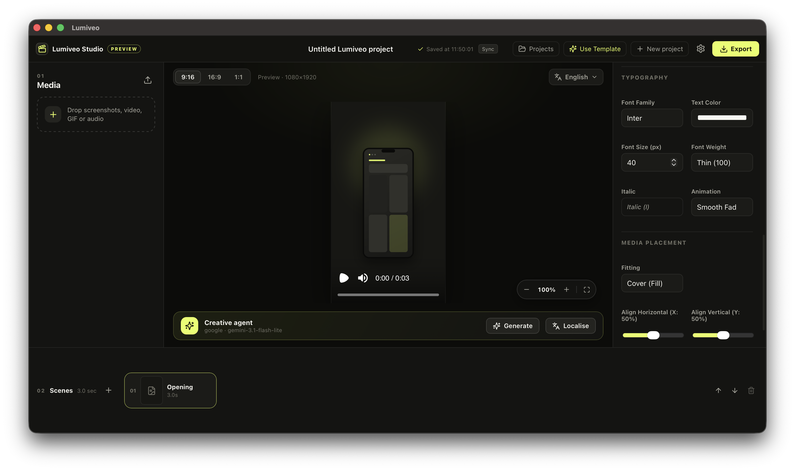

# Lumiveo



Create polished app demo videos from your screenshots, recordings, GIFs, and audio — with AI-assisted storyboarding, full typography/animation controls, localisation, background soundtrack, and portable project archives.

Built with the **Native SDK** (Zig native shell + WKWebView), **Remotion** (programmatic video), and the **Vercel AI SDK** (provider-agnostic AI).

## Author

**Gabriel Ajenifuja** — [github.com/fujahgabriel](https://github.com/fujahgabriel)

## Architecture

| Layer | Tech | Responsibility |
| --- | --- | --- |
| Native shell | Native SDK (`app.zon`, `src/main.zig`) | Window, security policy, bridge commands, native dialogs, worker lifecycle |
| Editor UI | React + Vite (`frontend/`) | Media library, timeline, inspector, Remotion Player preview, onboarding/settings, localisation |
| Local worker | Node 24 (`worker/`) | HTTP API, SQLite (`node:sqlite`), portable project files, Remotion render jobs, AI/TTS adapters, analytics queue, Keychain secrets |
| AI agent | Vercel AI SDK (`worker/src/ai.ts`) | Storyboard/localisation generation; provider-agnostic (OpenAI, Anthropic, Google, local, custom) |

```
frontend (zero://app / :5173)  ──HTTP+token──▶  worker (127.0.0.1:4817)
        ▲ window.zero.invoke                      ├── SQLite (settings, jobs, history, analytics queue)
        └── app.workerInfo / native dialogs ◀── native shell (spawns worker in packaged builds)
```

- **Portable projects** stored as `.lumiveo` bundles at `~/Library/Application Support/Lumiveo/Projects/<id>.lumiveo/` (`project.json` + `assets/`). SQLite is only the app index — user work survives a database wipe.
- **Secrets** stored in macOS Keychain (`com.lumiveo.providers`); SQLite keeps only provider config.
- **Analytics** is consent-gated, allowlist-only (key events + sanitized exceptions), queued in SQLite, with PostHog / Firebase / no-op adapters.

## Commands

```sh
npm install && npm --prefix frontend install && npm --prefix worker install

npm run dev          # worker (tsx watch) + native shell with Vite dev server
npm run check        # tsc (frontend + worker) + native check
npm run test         # vitest suites
npm run build        # frontend dist + worker dist + native ReleaseFast binary
npm run package:mac  # full .app pipeline, ad-hoc signed
npm run doctor       # native doctor --manifest app.zon --strict
```

`npm run dev` sets `APP_DEMO_WORKER_EXTERNAL=1` implicitly by running the worker separately; the packaged shell spawns `Contents/Resources/worker` itself and hands the frontend a per-launch token via the `app.workerInfo` bridge command.

## AI providers

Onboarding and Settings list models **live** from each provider's model API (with curated offline fallback):

- **OpenAI, Anthropic, Google** — direct provider APIs
- **Custom (OpenAI-compatible)** — Ollama (`http://127.0.0.1:11434/v1`), LM Studio, OpenRouter, Groq
- **Local draft** — deterministic offline storyboards, no key required

Each provider row shows where to copy its API key. Default provider is `local`.

## Exports

MP4 (H.264), animated GIF, or PNG sequence — in 9:16 (1080×1920), 16:9 (1920×1080), or 1:1 (1080×1080), per content locale. Render jobs run in the worker with progress, cancellation, and crash recovery (`render_jobs` ledger in SQLite). Quality selector (Draft / Normal / High) controls CRF. On completion, a native save dialog lets you pick the output location.

## Contributing

Contributions are welcome! Feel free to open a pull request or submit an issue. By contributing, you agree that your contributions are licensed under the same terms as this project's license.

## License

[Lumiveo Non-Commercial License](LICENSE) — Free to use, modify, and share for non-commercial purposes. Not for commercial or profit use. See the [LICENSE](LICENSE) file for full terms.
